# PLAN: MediMan Telehealth Website

## Goal
Build the complete MediMan marketing website with a high-performance **Doctors List & Search** engine. The site must be SEO-optimized, fast ("not an app"), and match the specific brand identity.

## Tech Stack
- **Framework:** Next.js 14+ (App Router)
- **Styling:** Tailwind CSS + Shadcn/UI
- **Data:** Node.js Backend API (existing)
- **Deployment:** Vercel (recommended)

## Brand Identity
- **Primary:** `#CC0052` (Red/Pink), `#1751C2` (Blue)
- **Alternate:** `#7E57C2` (Purple)

## Sitemap
1.  **Home (`/`)**: Hero, "How it works", featured doctors, testimonials, footer.
2.  **Doctors (`/doctors`)**: Searchable list with filters (Specialty, Location).
3.  **Doctor Profile (`/doctors/[id]`)**: Detailed view + "Book Now".
4.  **About (`/about`)**: Mission, Vision, Team.
5.  **Contact (`/contact`)**: Form + Map + Info.
6.  **FAQ (`/faq`)**: Accordion style Q&A.

## home page content 

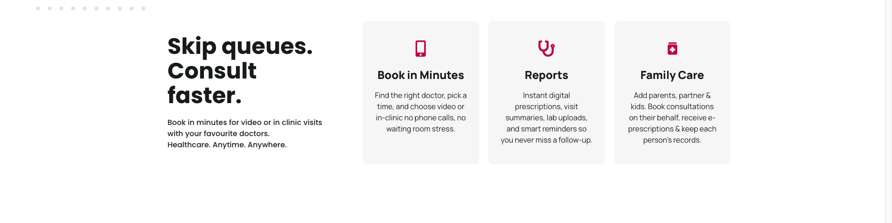
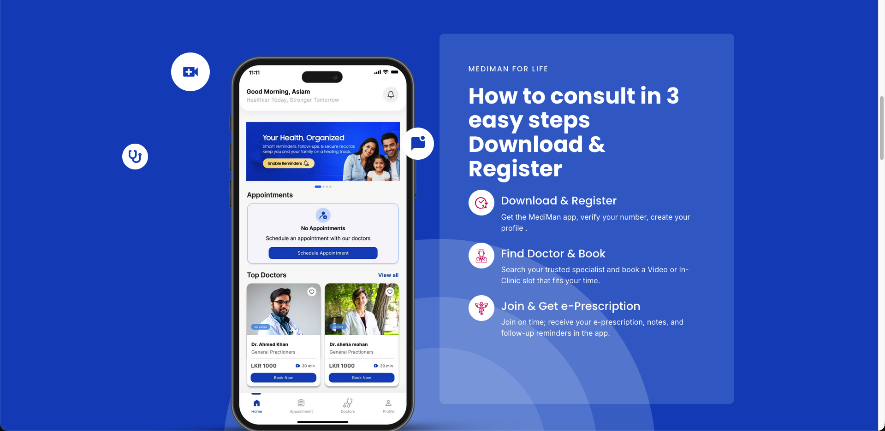
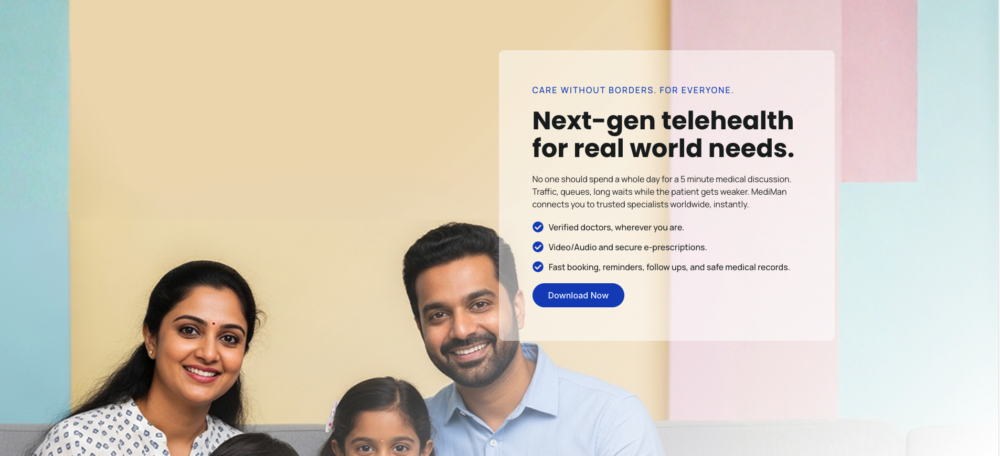
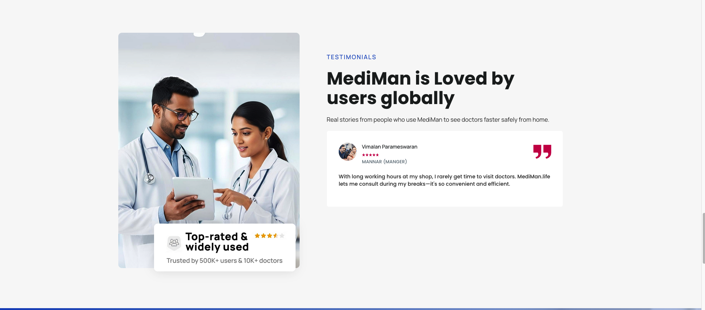
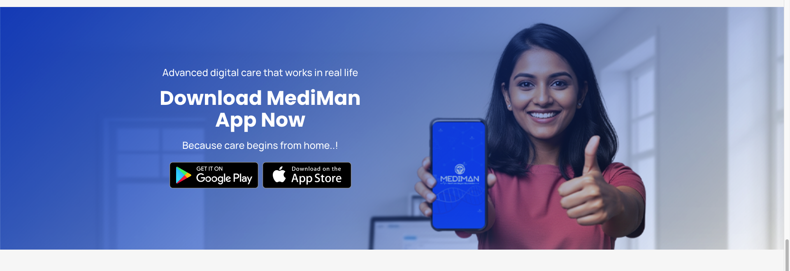

## contact page content 
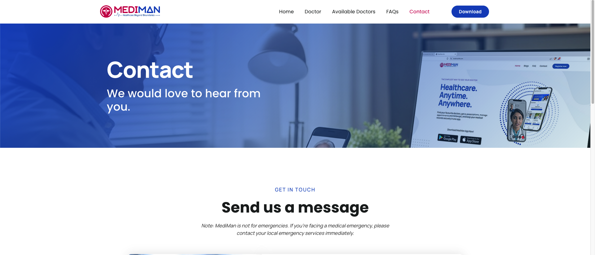
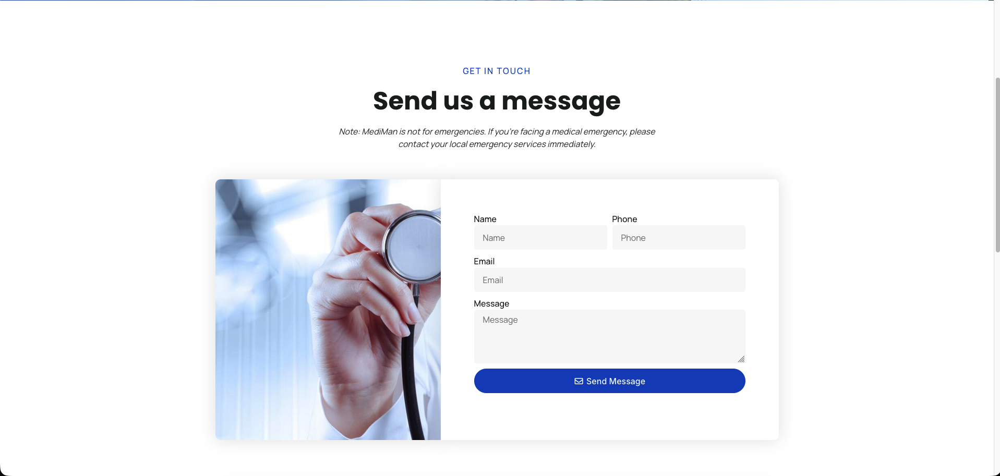
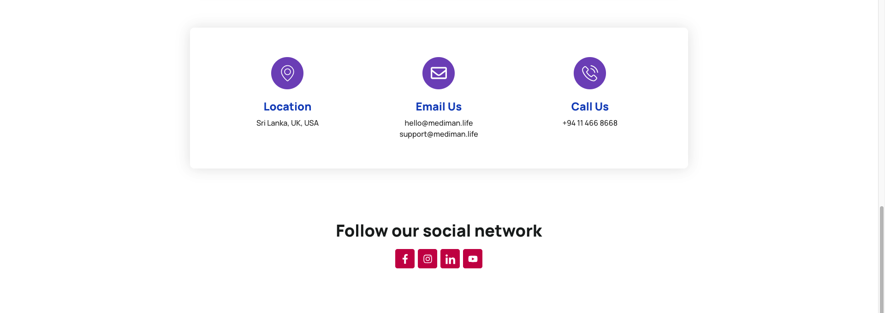

#FAQ Page content 
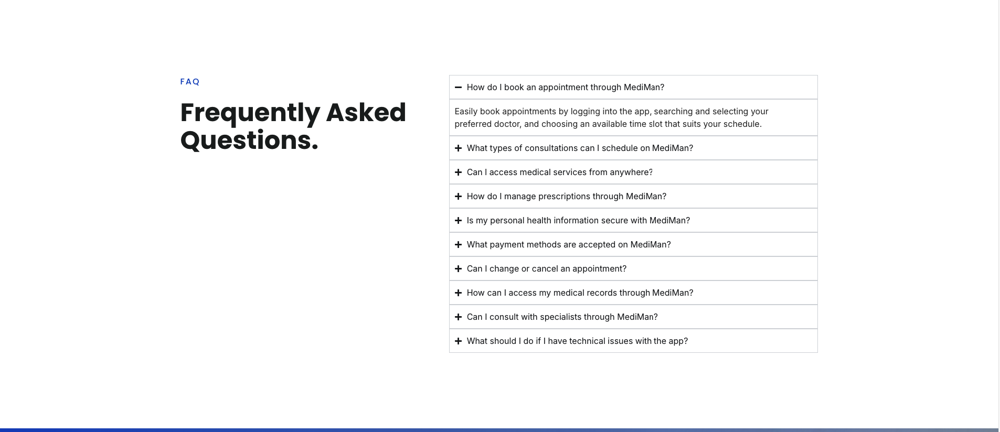

#doctor page content 
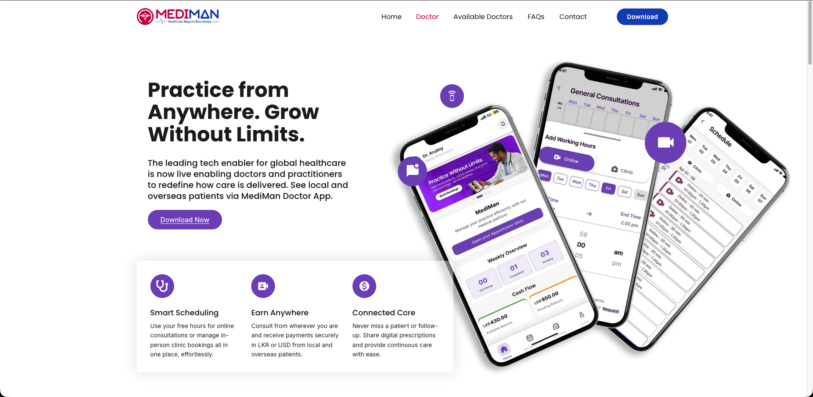
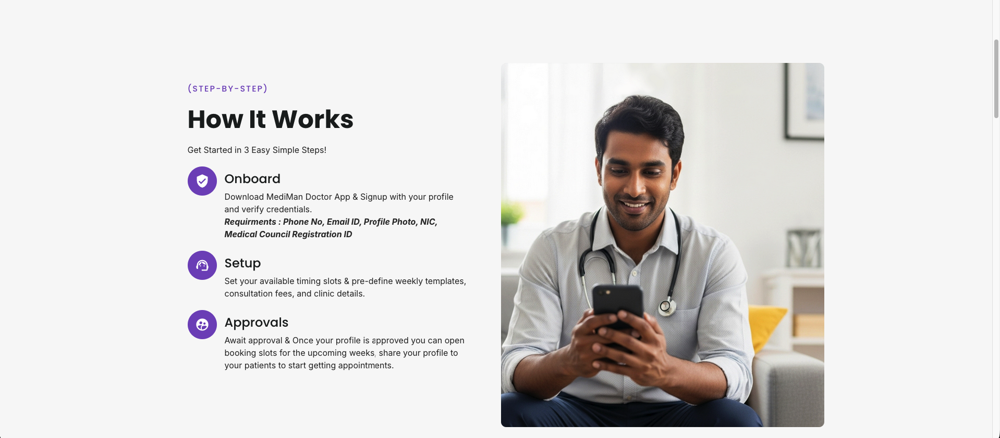

MediMan Doctor App
Frequently Asked Questions.
What is MediMan Doctor App?

MediMan Doctor App is a secure telehealth platform that enables you to consult patients online via video, audio, or chat. It helps manage both online and in-person appointments, issue e-prescriptions, track follow-ups, and receive payouts – all in one system.
How do I join the MediMan Doctor Network?
What documents are required for verification?
Can I set my own consultation fees?
How do I receive payments?
Can I consult patients from overseas?
Can I manage both online and clinic appointments together?
Is e-Prescription legal and accepted by pharmacies?
How do I handle patient follow-ups?
What if my consultation is interrupted or the patient doesn’t join?
Can I view my consultation history and earnings?
What happens if I need technical assistance?
Can I pause my availability or take a break?
How are patient ratings and feedback managed?
Is there any joining or subscription fee?
Can I integrate MediMan with my clinic’s software or system?
How does MediMan ensure clinical accountability?
Can I issue medical certificates or lab referrals digitally?
Why should I join MediMan? 

## Task Breakdown

### Phase 1: Setup & Design System
- [ ] **Initialize Project**
    - `npx create-next-app` with TypeScript, Tailwind.
    - Set up `globals.css` with brand variables (`--primary-red`, `--primary-blue`).
    - Configure fonts (Inter/Outfit).
    - *Verify:* Home page renders with correct brand colors.
- [ ] **Component Library (Shadcn)**
    - Install `button`, `card`, `input`, `select`, `accordion`.
    - Customize components to match MediMan style.

### Phase 2: Core Pages (Static)
- [ ] **Header & Footer**
    - Responsive Navbar (Logo, Links, "Download App" CTA).
    - Footer with social links, legal pages, quick links.
- [ ] **Home Page**
    - Hero Section: "Healthcare. Anytime. Anywhere."
    - "How it Works" steps.
    - App Download links (Play Store/App Store).
- [ ] **About & Contact**
    - Static pages with responsive layouts.

### Phase 3: The Doctors Engine (Dynamic)
- [ ] **API Integraton**
    - `actions/getDoctors.ts`: Fetch list with filters.
    - `actions/getDoctorById.ts`: Fetch single profile.
- [ ] **Doctors List Page (`/doctors`)**
    - **Server Component**: Fetch data based on URL search params.
    - **Client Component**: Filter Sidebar (Specialty, Location).
    - **Card Component**: Display doctor info with generic fallback image.
- [ ] **Doctor Profile Page (`/doctors/[id]`)**
    - Dynamic Route.
    - Fetch doctor details server-side.
    - Dynamic `generateMetadata` for SEO (Title = Doctor Name).

### Phase 4: SEO & Performance
- [ ] **SEO Optimizations**
    - `sitemap.xml` generation (dynamic for doctors).
    - `robots.txt` configuration.
    - JSON-LD Schema (Organization, MedicalWebPage, Physician).
- [ ] **Performance**
    - `next/image` optimization.
    - `dynamic` imports for heavy components.

## Verification
- [ ] Mobile Responsiveness: Menu works, layout stacks correctly.
- [ ] SEO Check: "Dr. Vimalan" page has correct title/description in source.
- [ ] Functionality: Filtering by "Cardiologist" updates URL and list.
- [ ] Brand Integrity: Colors match hex codes exactly.
